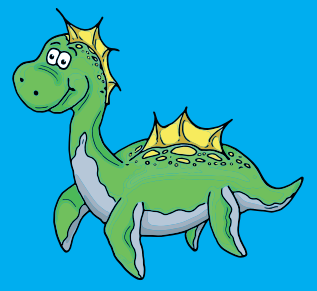

# find-lunzi-sg

The BioGeocaching - Find Lunzi loop is a scavenger hunt.
Author: [WasserCluster](https://wcl.ac.at/en/)




## How to find Lunzi?

The BioGeocaching - Find Lunzi loop is a scavenger hunt. 

By answering the questions, you will figure out GPS coordinates
that will lead you to Lunzi`s hiding place. You can find the
questions on the inside of this brochure. If you follow the route
around the lake below, you will come across various information
boards with the answers. For each station and question you will
receive a digit of the GPS coordinates you are looking for. Once
you have read all the signs and answered the questions.

## Questions per Station
[Question 1](./question/question_01.md)

## Answers per Station

### Table

### Code
The following formula calculates variable $b$.

$$ \frac{a}{b}=10 $$

###
You should set up a constant `a=20` and the following snippet code.

```
a = 20
b = 10
c = a * b
```


